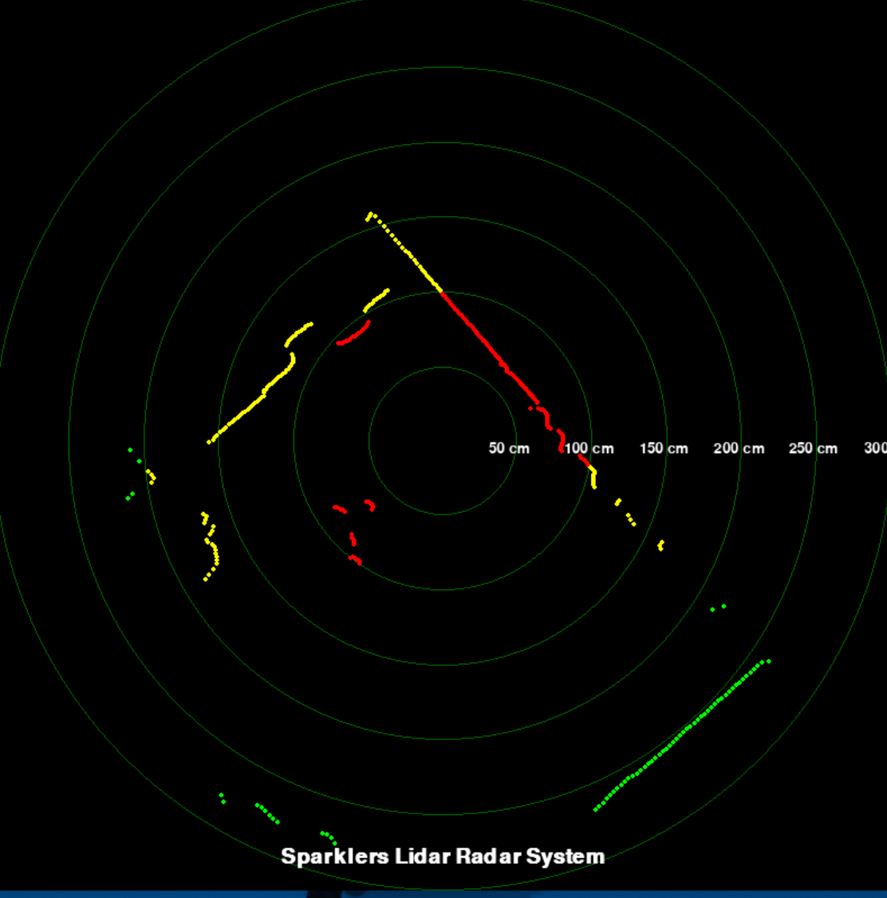

# 🎯 Sparklers Lidar Radar System

A real-time 2D radar-style visualization for **RPLidar** sensors, built with Python and `pygame`.  
Plots live LIDAR points with **distance-based colors** (red for close, yellow for medium, green for far), and reference circles for quick distance approximation.  

  
*Example visualization output*  

---

## ✨ Features
- 📡 **Real-time LIDAR plotting** in a radar-like view  
- 🎨 **Distance-based color coding**  
  - **Red** → Close (≤ 1.0 m)  
  - **Yellow** → Medium (1.0 – 2.0 m)  
  - **Green** → Far (2.0 – 3.0 m)  
- 🔄 Updates once per full rotation (avoids point overlap)  
- 🟢 **Distance rings & labels** every 50 cm for visual reference  
- 🖥 **Custom Pygame interface** with project title display  

---

## 📦 Requirements
- Python 3.7+
- [PyRPlidar](https://pypi.org/project/pyrplidar/)  
- [Pygame](https://www.pygame.org/)  

Install dependencies:
```bash
pip install pygame pyrplidar
